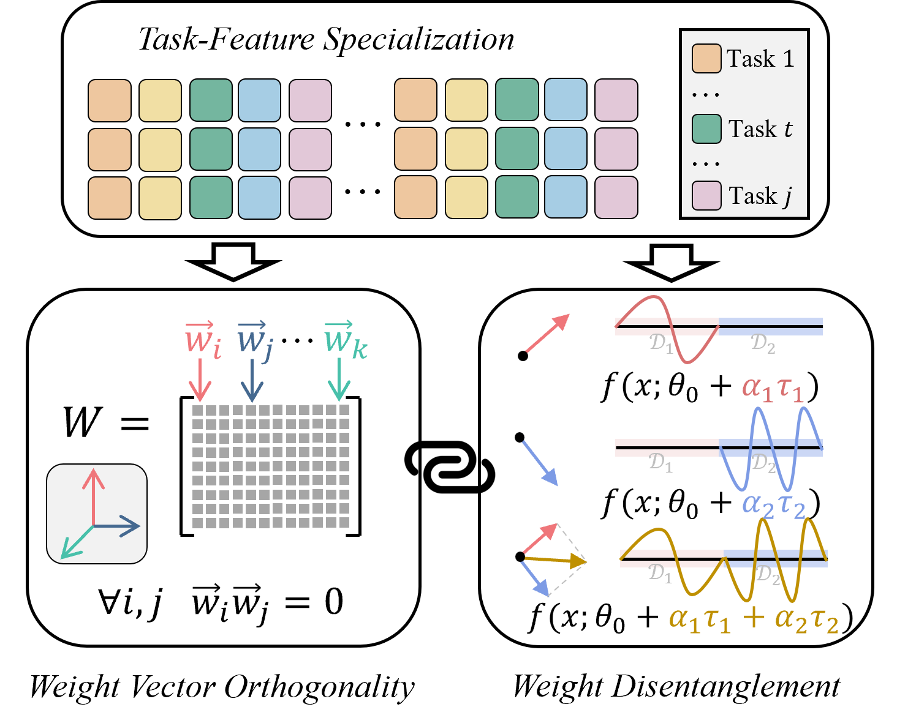
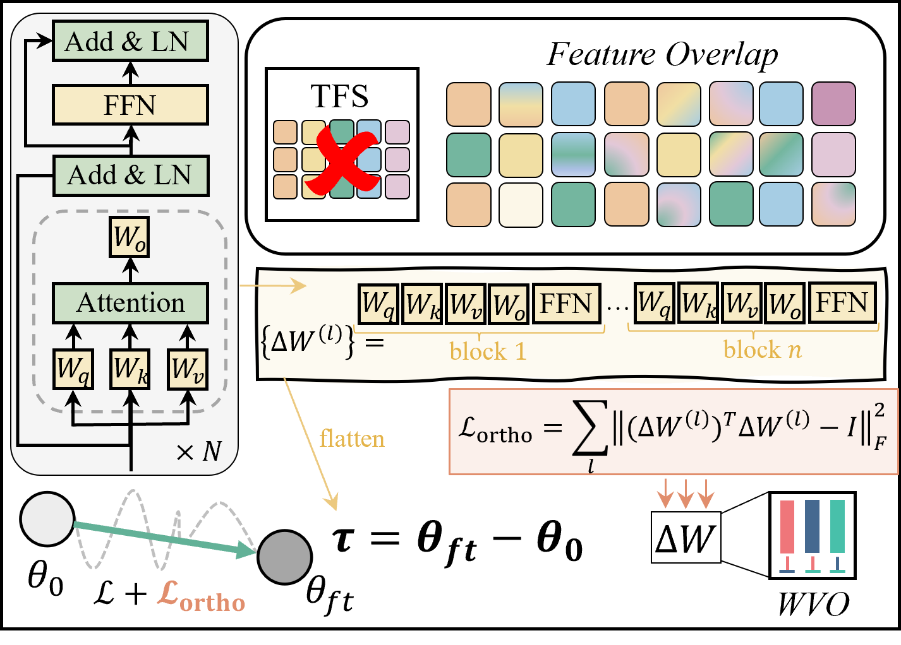

# Understanding and Enforcing Weight Disentanglement in Task Arithmetic

[CVPR 2026] Official code of the paper **"Understanding and Enforcing Weight Disentanglement in Task Arithmetic"**.

[[Paper](https://arxiv.org/abs/2604.17078)] &nbsp; [[Checkpoints](#-checkpoints)] &nbsp; [[Datasets](#-datasets)]

---

## 🎯 Abstract

Task arithmetic provides an efficient, training-free way to edit pre-trained models, yet lacks a fundamental theoretical explanation for its success. The existing concept of "weight disentanglement" describes the ideal outcome of non-interfering task composition but does not reveal its underlying cause. Crucially, what intrinsic properties of the pre-trained model ($\theta_0$) or the task vectors ($\tau_t$) enable this disentanglement remains underexplored. In this paper, we introduce Task-Feature Specialization (TFS), a model's ability to allocate distinct internal features to different tasks, as the fundamental principle. We first prove that TFS is a sufficient condition for weight disentanglement. More importantly, we find that TFS also gives rise to an observable geometric consequence: weight vector orthogonality. This positions TFS as the common cause for both the desired functional outcome (disentanglement) and a measurable geometric property (orthogonality). This relationship provides the key insight for our method: since the abstract TFS property is intractable to enforce directly, we can instead promote weight disentanglement by shaping its concrete geometric consequence, orthogonality. Therefore, we propose OrthoReg, a simple and effective regularization method that actively enforces an internal orthogonal structure on weight updates ($\Delta W$) that constitute $\tau_t$ during fine-tuning. And we theoretically prove that OrthoReg promotes disentanglement. Extensive experiments demonstrate that OrthoReg consistently and significantly enhances the performance of various task arithmetic methods.

<p align="center">
  
  <br>
  <em>TFS is the common cause connecting Weight Vector Orthogonality (WVO) with Weight Disentanglement (WD).</em>
</p>

### ✨ Key Contributions

- 📐 **Theory**: We identify TFS as a sufficient condition for weight disentanglement, and WVO as its geometric consequence, providing the first principled explanation for task arithmetic.
- 🔧 **Method (OrthoReg)**: A simple regularization term added to the fine-tuning loss that enforces column-wise orthogonality on ΔW, for which we prove theoretical efficacy.
- 🔗 **Connection to TTA**: We show that OrthoReg and Tangent Task Arithmetic (TTA) share the same underlying mechanism (i.e. inter-task vector orthogonality), but OrthoReg achieves this more efficiently.
- 📊 **Experiments**: Consistent and significant improvements over Non-linear FT, TTA, ATT-FT, LoRA-ATT across ViT-B-32, ViT-B-16, and ViT-L-14.

---

### The OrthoReg Loss

<p align="center">
  
</p>

The total loss adds a regularization term to the standard task objective:

$$\mathcal{L} = \mathcal{L}_{\text{task}}(\theta_0 + \Delta\theta) + \lambda \cdot \mathcal{L}_{\text{ortho}}(\Delta\theta)$$

$$\mathcal{L}_{\text{ortho}}(\Delta\theta) = \sum_l \left\|(\Delta W^{(l)})^\top \Delta W^{(l)} - I\right\|_F^2$$

---

## 🛠️ Installation

This codebase is built on top of [Tangent Task Arithmetic (TTA)](https://github.com/gortizji/tangent_task_arithmetic). Environment setup follows theirs exactly.


To run the code, please install all its dependencies:
```sh
conda env create
conda activate tangent-arithmetic
```
and add the `src` directory to the `PYTHONPATH`:
```sh
cd OrthoReg
export PYTHONPATH="$PYTHONPATH:$PWD"
```

---

## 📦 Datasets

We evaluate on 8 image classification benchmarks following [Task Arithmetic](https://github.com/mlfoundations/task_vectors) and [TTA](https://github.com/gortizji/tangent_task_arithmetic):

**Cars · DTD · EuroSAT · GTSRB · MNIST · RESISC45 · SUN397 · SVHN**

For dataset download and preparation, please follow the instructions in the [TTA repository](https://github.com/gortizji/tangent_task_arithmetic#datasets).

We also provide a pre-packaged dataset archive for convenience:

> 📥 **Dataset Download:** `https://pan.baidu.com/s/1PgLyjUrAhsmgSAz4ms5mcQ?pwd=fwf5`

Set the root path via `--data-location /path/to/datasets/`.

---

## 🚀 Quick Start

All scripts are run from the `OrthoReg/` directory. This repository implements **6 finetuning modes**:

| `--finetuning-mode` | Description |
|---|---|
| `standard` | Non-linear full fine-tuning (baseline) |
| `standard_ortho` | Non-linear FT + OrthoReg |
| `linear` | TTA — tangent space fine-tuning (baseline) |
| `linear_ortho` | TTA + OrthoReg |
| `linear-2` | ATT-FT — attention-only fine-tuning (baseline) |
| `linear-2_ortho` | ATT-FT + OrthoReg |

> **Note on LoRA-ATT:** The LoRA-ATT and LoRA-ATT+OrthoReg results from the paper are implemented in a separate repository due to the complexity of patching OpenCLIP's fused QKV projection. Code will be released at: `https://github.com/lshangge/OrthoReg_lora`

### Step 1 — Fine-tune

```bash
python src/finetune.py \
    --model ViT-B-32 \
    --finetuning-mode standard_ortho \
    --ortho-lambda 10 \
    --lr 1e-5 \
    --data-location /path/to/datasets/ \
```

Switch between all six modes by changing `--finetuning-mode` and `--ortho-lambda`:

```bash
--finetuning-mode standard       --ortho-lambda 0     # Non-linear FT
--finetuning-mode standard_ortho --ortho-lambda xx    # Non-linear FT + OrthoReg
--finetuning-mode linear         --ortho-lambda 0     # TTA
--finetuning-mode linear_ortho   --ortho-lambda xx    # TTA + OrthoReg
--finetuning-mode linear-2       --ortho-lambda 0     # ATT-FT
--finetuning-mode linear-2_ortho --ortho-lambda xx    # ATT-FT + OrthoReg
```

Checkpoints are saved to:
- `checkpoints_{seed}/{mode}_{lr}_{model}/` — for baselines
- `checkpoints_{seed}/{mode}_{lr}_lambda{lambda}_{model}/` — for OrthoReg variants

### Step 2 — Evaluate Single-Task Accuracy

```bash
python src/eval_single_task.py \
    --model ViT-B-32 \
    --finetuning-mode standard_ortho \
    --ortho-lambda 10 \
    --lr 1e-5 \
    --data-location /path/to/datasets/
```

> Run `eval_single_task` with `--finetuning-mode none --ortho-lambda 0` first to generate `zeroshot_accuracies.json`, which is required as the reference for normalized accuracy in Steps 3–4.

### Step 3 — Evaluate Task Addition

```bash
python src/eval_task_addition.py \
    --model ViT-B-32 \
    --finetuning-mode standard_ortho \
    --ortho-lambda 10 \
    --lr 1e-5 \
    --data-location /path/to/datasets/
```

### Step 4 — Evaluate Task Negation

```bash
python src/eval_task_negation.py \
    --model ViT-B-32 \
    --finetuning-mode standard_ortho \
    --ortho-lambda 10 \
    --lr 1e-5 \
    --data-location /path/to/datasets/
```

---

## 🔧 Key Arguments

| Argument | Default | Description |
|---|:---:|---|
| `--model` | `ViT-B-32` | CLIP model architecture |
| `--finetuning-mode` | — | One of the 6 modes above |
| `--ortho-lambda` | `0.0` | OrthoReg strength λ; set to `0` for baselines |
| `--lr` | `1e-5` | Learning rate |
| `--seed` | `1993` | Random seed |
| `--world-size` | `1` | Number of GPUs (DDP) |
| `--data-location` | — | Dataset root directory |
| `--batch-size` | `128` | Batch size per GPU |

---

## 📁 Checkpoints

We release fine-tuned checkpoints for ViT-B-32, ViT-B-16, and ViT-L-14 on all 8 tasks, covering all 6 modes.

> 📥 **Checkpoint Download:** `https://huggingface.co/gezi2333/OrthoReg_checkpoints`

Unzip into `OrthoReg/checkpoints_{seed}/` and pass the corresponding `--seed`, `--lr`, and `--ortho-lambda` to the eval scripts to reproduce the paper's results directly.

---

## 📝 Citation

If you find this work useful, please cite:

```bibtex
@inproceedings{liu2026orthoreg,
  title     = {Understanding and Enforcing Weight Disentanglement in Task Arithmetic},
  author    = {Liu, Shangge and Yin, Yuehan and Wang, Lei and Fan, Qi and
               Shi, Yinghuan and Li, Wenbin and Gao, Yang and Tao, Dacheng},
  booktitle = {CVPR},
  year      = {2026}
}
```

---

## 📞 Contact

For questions or issues, please:

- Open an issue on GitHub
- Contact the authors at [lshangge@smail.nju.edu.cn]

---

## 📬 Acknowledgements

This codebase is built on top of [Task Arithmetic](https://github.com/mlfoundations/task_vectors), [Tangent Task Arithmetic](https://github.com/gortizji/tangent_task_arithmetic), and [Attention-Only Fine-tuning](https://github.com/kyrie-23/linear_task_arithmetic). We thank the authors for releasing their code.

